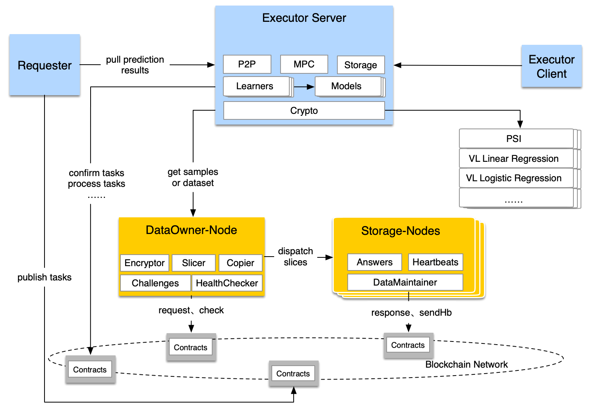

<!--  -->

# PaddleDTX <small>1.1</small>

> 一个基于**去中心化存储**的专注于**分布式机器学习**技术的解决方案

- 支持多个学习过程**并行**运行的**多方安全计算**框架
- **安全存储**高敏感数据，防止隐私泄漏，支持故障容错，抵御存储作弊
- 去中心化管理存储节点，支持**无上限**数据纳管
- 保证多方数据联合建模的**全链路可信**

[GitHub](https://github.com/docsifyjs/docsify/)
[Get Started](#app)

<!-- 背景图片 -->

<!--  -->

<!-- 背景色 -->

<!--  -->